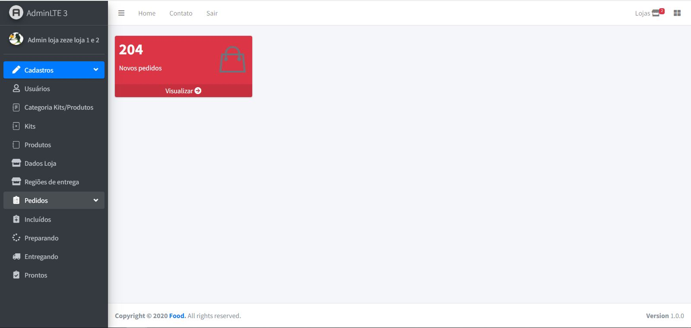

# Delivery - Project - Lietoo

This project is a dashboard of delivery for products, foods and services.
The project was create and developed by myself. (Luís Paulo G. L.).
The project contains administration tools of products, foods and services.

Technologies used:
1. FrameWork Laravel. Version: > 7.
1. PHP Language to back end. Version PHP: PHP/7.2.34.
1. Vue.js to front end more html 5 and css 3. Version Vue: 2.6.12.
1. MariaDB to data base. Version: 10.4.14-MariaDB.

##### Website/Dashboard: [https://www.pt-lietoo.com/](https://www.pt-lietoo.com/)

## Screenshot

  

  

  

  

  

## Installation

1. Clone the repo and `cd` into it.
2. `composer install`.
3. Rename or copy `.env.example` file to `.env` comand `copy .env.example .env`.
4. Alter if will you want the `APP_NAME` have name whatever you want.
5. Set your `APP_URL` in your `.env` file. This is needed for Vue to correctly resolve asset URLs.
6. `php artisan key:generate`.
7. Set your database credentials in your `.env` file.
8. Set your FaceBook Social Media credentials in your `.env` file. Specifically `FACEBOOK_CLIENT_ID` and `FACEBOOK_CLIENT_SECRET`.
9. Set your Google Social Media credentials in your `.env` file. Specifically `GOOGLE_CLIENT_ID` and `GOOGLE_CLIENT_SECRET`.
10. Set your PayPal credentials in your `.env` file if you want to use PayPal. Specifically `PAYPAL_MODE` and `PAYPAL_CLIENT_ID_LOCAL` and `PAYPAL_SECRET_LOCAL`.
11. Set your Twilio credentials in your `.env` file if you want to use Twilio. Specifically `TWILIO_CLIENT_ID` and `TWILIO_CLIENT_TOKEN`. 
12. `php artisan project_delivery:install`. This will migrate the database and run any seeders necessary.
13. `npm install`.
14. `npm run dev`.
15. `php artisan storage:link` for link storage directory to public.
16. `php artisan serve` or use Laravel Valet or Laravel Homestead.
17. Visit `localhost:8000` in your browser.

## Starting from a particular point

1. Clone the repo and `cd` into it.
1. Follow the rest of the steps above. Instead of `php artisan project_delivery:install`, migrate and seed the normal way with `php artisan migrate --seed`.
